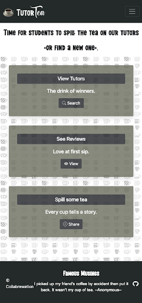

# tutortea
Spill the tea on your tutor or find a new tutor that fits your learning style, & schedule.

TUTOR TEA

Repo Link:
          https://github.com/lonewolfco/tutortea

Live Url: 
          https://tutor-tea.herokuapp.com/

Goal/Motivation:

          When a user of the school or Tech program that is so fortunate to sign a worthy negotiable contract with the creators of Tutor Tea, the student will have the ability/access to a database of reviews of tutors provided by students for students benefit, but provided login access by the school or program included in the students paid tuition with that program.

          The student will login into Tutor Tea, their user info will be stored for future login easy access, and they can review the tutor of their choice with the stored prior reviews on that new tutor they may choose. The student can also leave a review on their current tutor, good or bad. 

          This will be logged if they choose for a future student to see and decide to take or choose another tutor based on that review. 

          That review will include, times available, based on Daytime, Nights, and Weekends.

          A review written by the prior or current student. 

          And lastly, but the thing most care about, the 1-5 rating. 

Problems Solved:

          Over the course of this bootcamp, our Team here at TutorTea and many others, have experienced the challenge of finding the right tutor to mesh with our busy lives. Finding the tutor to mesh with our specific area of coding that no matter where we look, what we watch or listen to, cannot be learned or retained. We need a new form of explanation but are looking into a bucket of hundreds to choose from. 
          
          When looking for this ideal perfect tutor, we found our best resource was our fellow classmates' recommendations. We then thought, why doesn't a database exist for students to research who the tutor was and when they might find a middle ground to meet. 
          
          The TutorTea gives students the ability to spill the Tea on their tutor good or bad. Future students will be able to come to our site and find the unicorn tutor like they would a movie on rotten tomatoes or google stars for that killer happy hour. For most today, live in a world of reviews and stars to guide our decisions. So, at TutorTea we bring that to the realm of finding a tutor.

The Standouts:

          I think from the very beginning what made our project feel unique was its lack that it doesn't exist already. 

          Our team did an incredible job on the user interface and the overall appearance on our site, down to every page. Even the page about us, the authors, was a debate on the appropriate img to group us all as the heading.
          
Challenges Faced:
        
          Handlebars implementation with partials and main were a challenge. The Nav bar would conflict with any handlebars pages rendered in the body and their corresponding JS files. Also toast messages we a battle in themselves.

          Also, just logistical challenges, like meeting while two members were traveling and another was moving.

PREVIEW 
OF TUTOR TEA:

-USER DEMONSTRATION
         <href><iframe src="https://drive.google.com/file/d/1VNaUs-ZDHxfihaRyXW4y_Ucx3L1YXTXm/preview" width="640" height="480"></iframe>

SCREENSHOTS:

-MAIN PAGE
          
-DASHBOARD
           
-SPILLING THE TEA
          
-ACTIVE TUTORS
          
-THE COLLABREATORS
           